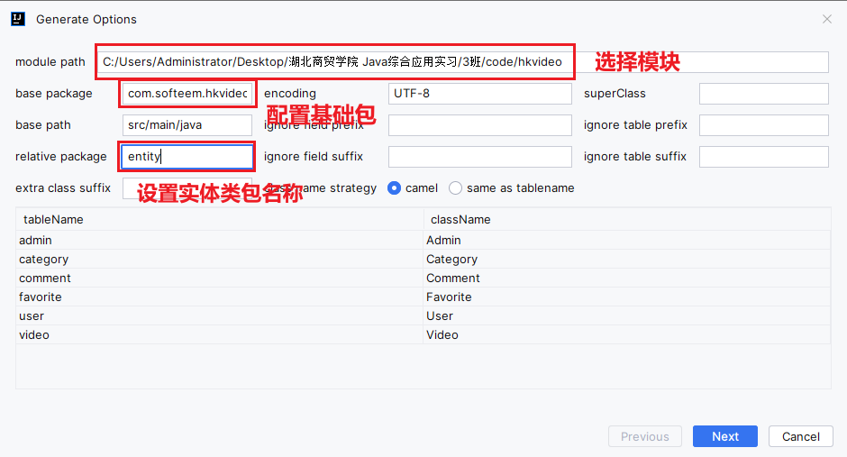

# day03 - 高效后台项目结构搭建

## 1. 使用spring initializr快速构建springboot项目


## 2. idea内置数据库插件使用

## 3. MybatisX逆向生成后台结构





## 4. 加密加盐实现

```java
//1.生成一个随机盐（token）
String salt = RandomUtil.randomString(32);
//2.将输入密码和随机盐组合加密
String pwd = admin.getPassword() + salt; //123456abcde
pwd = SecureUtil.md5(pwd);               //EDUDNASTYPOD7D9DSDDFVBXCUIXYCI
//3.将随机盐和加密后的密码同时保存
admin.setSalt(salt);
admin.setPassword(pwd);
//4.保存到数据库
adminService.save(admin);
```

## 5. 完善统一返回结果定义


## 6. AI代码生成插件